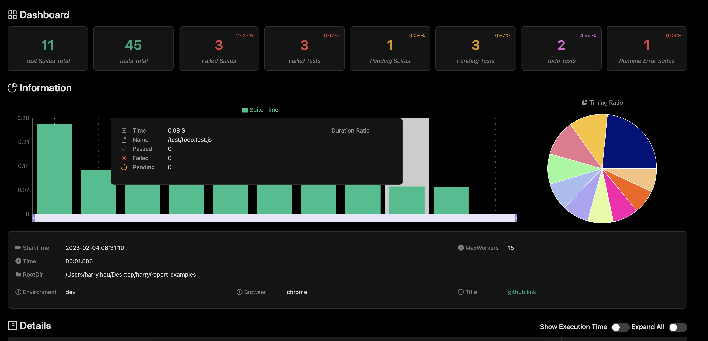
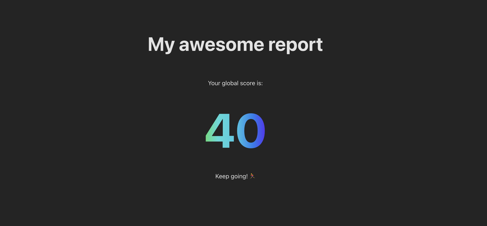
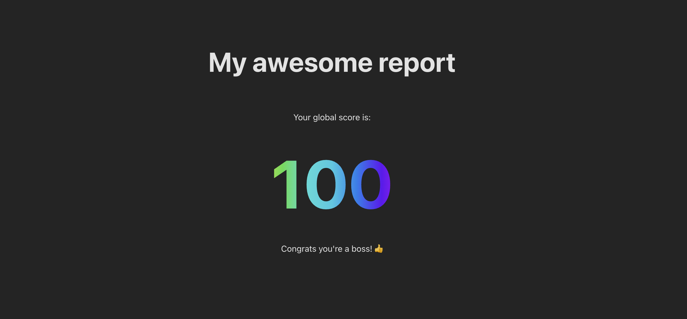

# Context

I work on an open source project: [sls-mentor](https://www.sls-mentor.dev/), that audits an aws stack and give advices on the best practices to configure serverless resources on AWS.

On the project, we wanted to add a feature of report generation to have a visual document with every important information at a glance and that can be shared easily.

# Requirements
- Report generation is done in a CLI ⌨️
- The report is pretty 💄
- As a fullstack developper, I wanted to use a tool that I know well to generate the report: [React](https://react.dev/)

# Tech strategy
First, I started with a naive search on how other auditing tools were generating their reports. I found the example of [jest-html-reporter].(https://github.com/Hazyzh/jest-html-reporters/tree/master)

The report looks amazing ! 😍



And guess what ? It is written in react ! 🚀

## How does it work ?

In the details, I didn't understand everything 🙈, but it doesn't matter! What matters is the general idea !

So they have a React application, the app is built into a template html file.

The template file contains a placeholder string, for example for jest-html-report, it is:
```
module.exports = '<<<JEST-HTML-REPLACE-PLACEHOLDER>>>';
```

Then at runtime, jest copies the template file, then replace the placeholder with the result of the analysis and 💥 ! It generates an html report !

# Let's write a report template

## Create a react app

First, we need to create a react app, I used [vite](https://vitejs.dev/), but you can use [create-react-app](https://create-react-app.dev/) or any other tool.

``` yarn create vite my-report-template ```

Choose react, typescript, and no framework.

## Build the app as a single html file
Now you have a react app. Try to build it.

``` yarn install && yarn build ```

It generates a dist folder with an index.html file. But if you try to open it in your browser, you will see a blank page. 

If you open the index.html in an editor, you will notice it is almost empty, it just an empty div and some scripts to js files.

That's not what we want, we want a single html file that contains everything. So it is easy to share.

So we use this wonderful vite plugin: [vite-plugin-singlefile](https://github.com/richardtallent/vite-plugin-singlefile) 💪
  
  ``` yarn add -D vite-plugin-singlefile ```
  
  Then we add it to vite.config.ts
  
  ``` typescript
  import { defineConfig } from 'vite'
import react from '@vitejs/plugin-react'
import { viteSingleFile } from "vite-plugin-singlefile"


// https://vitejs.dev/config/
export default defineConfig({
  plugins: [react(), viteSingleFile()],
})
```

Now if you build again, you will have a single html file in the dist folder. 🎉

If you open it in your browser, you will see your app, except for a small detail: the images are not displayed! 😱 Because the images are absolute imports to other svg files in the dist folder. The issue is not problematic but a bit painful to fix: the svg must be converted into react components (but that is not the topic of this article 😜).

## Customize your report
Let's write a super simple report with just a score
  
  ``` typescript
  // App.tsx
  import './App.css'
  function App() {
  const score = 40
  return (
    <>
      <div>
        <h1>My awesome report</h1>
        <p> Your global score is:</p>
        <p className='score'>{score}</p>
        {score > 50 ? <p>Congrats you're a boss! 👍</p> : <p>Keep going! 🏃‍♂️</p>}

      </div>
    </>
  )
}

export default App
```
``` css
/* App.css */

#root {
  max-width: 1280px;
  margin: 0 auto;
  padding: 2rem;
  text-align: center;
}

h1 {
  font-size: 3rem;
  font-weight: bold;
  margin-bottom: 4rem;
}
.score {
  font-size: 8em;
  font-weight: bold;
  background-image: linear-gradient(90deg, rgba(255,0,0,1) 0%, rgba(255,154,0,1) 10%, rgba(208,222,33,1) 20%, rgba(79,220,74,1) 30%, rgba(63,218,216,1) 40%, rgba(47,201,226,1) 50%, rgba(28,127,238,1) 60%, rgba(95,21,242,1) 70%, rgba(186,12,248,1) 80%, rgba(251,7,217,1) 90%, rgba(255,0,0,1) 100%);
  margin: auto;
  -webkit-text-fill-color: transparent;
  background-clip: text;
  -webkit-background-clip: text;
  color: transparent;
}
```

Well, it is not the most beautiful report, but it is a start. 🤷‍♂️


## Pass data to the report
Now we want to pass data to the report.

For sls-mentor, we used a [react context](https://react.dev/learn/passing-data-deeply-with-context) to pass the data to the report. But for the sake of simplicity, we will use here a simple variable.

``` typescript
// replace App function with following code

function App() {
  // for development purposes, we want to have a default result
  let result: Result;
  try
  { 
    result = JSON.parse('<<<RESULTS_PLACEHOLDER>>>') as Result
  } catch (e) {
    result = { score: 40 }
  }

  return (
    <>
      <div>
        <h1>My awesome report</h1>
        <p> Your global score is:</p>
        <p className='score'>{result.score}</p>
        {result.score > 50 ? <p>Congrats you're a boss! 👍</p> : <p>Keep going! 🏃‍♂️</p>}

      </div>
    </>
  )
}
```

The placeholder `<<<RESULTS_PLACEHOLDER>>>` will be replaced by the result of the analysis.


## Test the template manually
Now we have a template, we want to test it. First, let's build the report again and copy it to a new file report.html.

Open the report.html in your editor, and search for `<<<RESULTS_PLACEHOLDER>>>`. Replace it with `{\"score\": 100}` (⚠️ don't forget to escape the quotes !). Save the file and open it in your browser. 

You should see the score 100!! 🎉.

## Automate !
In order to build the report from your cli, just automate the previous steps with a script:

- duplicate the template file to a new file report.html
- replace the placeholder with the result of the analysis and don't forget to escape the quotes

Easy isn't it ? 😎

Now it's your time to shine ! 🌟

